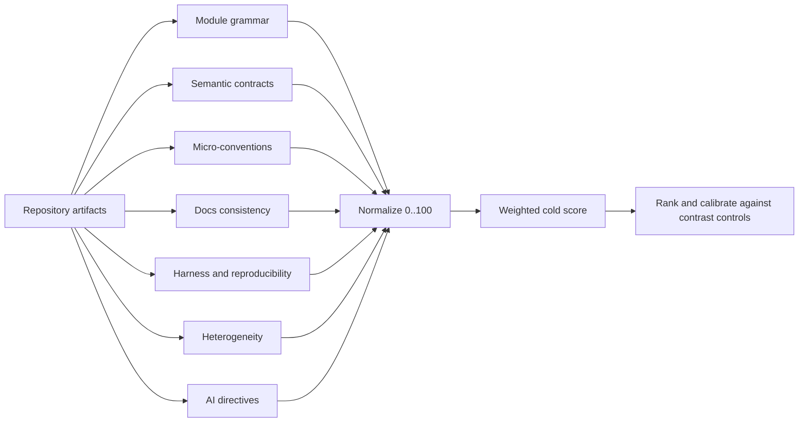
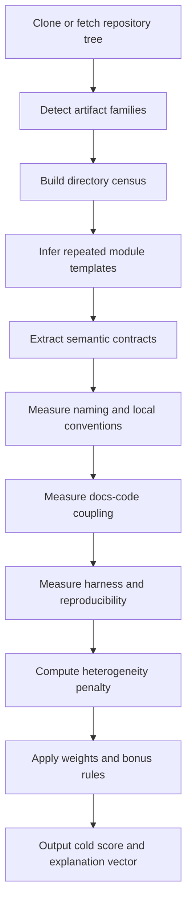

# Семантически холодные Python-репозитории как канон для метрики температуры

## Executive summary

Если пересчитать shortlist не как аудит «надсмотрщика», а как разбор кодовой стилистики и внутренней семантики, то картина заметно меняется. Лучшие канонические примеры «холодных» Python-репозиториев — это не просто проекты с сильным CI, CONTRIBUTING и релизной дисциплиной, а репозитории, где есть повторяемая **внутренняя грамматика модулей**, явные **семантические контракты API**, проверяемые **мелкие соглашения** и жесткая **сцепка документации с кодом**. В этом пересчете особенно сильны **Home Assistant Core**, **scikit-learn**, **pytest** и **pluggy**: у них правила буквально встроены в форму каталогов, имен, объектов и документационных шаблонов. citeturn31search3turn31search1turn31search4turn4search0turn5search4turn18search3turn26search0

Главный вывод продолжения исследования такой: крупные и очень зрелые проекты остаются образцовыми по operational guardrails, но уже не всегда являются лучшими **семантическими** эталонами. Условно, `pandas` и `NumPy` очень сильны как инженерные экосистемы, но их публичная структура уже многослойна и мульти-язычна; entity["organization","Apache","software foundation"] Airflow сам описывает себя как одновременно библиотеку и приложение, плюс отдельно версионирует core, providers, Helm chart и API clients; а entity["organization","Pallets","python web libs"] Flask прямо подчеркивает, что не навязывает layout проекта. Для метрики температуры это не «минус», а сигнал: такие проекты полезнее как **контрастные warm controls**, чем как чистые low-temperature каноны. citeturn27search0turn27search1turn28search0turn20search0

Отдельный важный нюанс: интересующие вас AI-era артефакты вроде `AGENTS.md` и `CLAUDE.md` пока не являются типичным признаком зрелого «холодного» Python-репозитория. По крайней мере, в верхнеуровневых деревьях просмотренных классических канонов — вроде Home Assistant, pytest и Django — они не выступают как основная публичная форма локальных соглашений; зато как **положительный современный контроль** это видно в `pydantic-ai-harness`, где есть `.agents`, `.claude`, `AGENTS.md` и `CLAUDE.md`. Отсюда практический вывод для метрики: учитывать такие файлы стоит, но как **малый бонус**, а не как обязательный критерий зрелости. citeturn14search3turn21search5turn19search2turn29search8

## Как меняется shortlist, если важна семантика

Под «семантическим холодом» я дальше понимаю низкую энтропию не только на уровне harness, но и на уровне самой формы кода: насколько внутри репозитория повторяются одни и те же модульные паттерны, насколько одинаково ведут себя однотипные классы и функции, насколько локальные соглашения можно восстановить из артефактов, и насколько документация описывает ту же грамматику, что и код. Именно поэтому в пересчете вверх идут относительно «чистые» репозитории с сильной внутренней алгеброй, а не обязательно самые большие. citeturn31search3turn4search0turn18search3turn26search0turn23search3

| Репозиторий-контраст | Почему он силён operationally | Почему он слабее как чистый semantic-cold canon | Источники |
|---|---|---|---|
| `pandas` | зрелая инфраструктура, документация, бенчмарки, типы, CI | публичное дерево уже включает `subprojects`, `typings`, `asv_bench`, а кодовая база сочетает Python, Cython и C — это увеличивает структурную неоднородность для «единой грамматики репозитория» | Repo tree и языки citeturn27search0 |
| `NumPy` | исторически образцовый core scientific stack | публично это многослойная мульти-язычная система: Python, C, C++, Cython, Meson, Fortran; такой репозиторий нужен скорее как high-rigor contrast, чем как low-entropy шаблон | Repo summary и языки citeturn27search1 |
| `Airflow` | очень сильные процессы, релизы, community governance | сам проект фиксирует, что по сути живет сразу в нескольких семантических плоскостях: core, providers, Helm chart, API clients, плюс «library and application» одновременно; это высокая platform-entropy | Repo README и versioning policy citeturn28search0 |
| `Flask` | зрелая документация и простая публичная API-модель | в корневом README Flask прямо говорит, что не навязывает dependencies и project layout; это делает его хуже именно как образец «жесткой внутренней грамматики репозитория» | Repo README и patterns docs citeturn20search0turn8search0turn8search6 |

Эти проекты я бы не выбрасывал из общей программы измерения температуры. Наоборот: они полезны как **калибраторы**. Если ваша метрика будет давать им слишком «холодный» балл только из-за CI, релизов и governance, значит вы всё ещё измеряете harness, а не семантику. citeturn27search0turn27search1turn28search0turn20search0

## Десять канонических репозиториев

Ниже — пересчитанный набор из десяти публичных Python-репозиториев, которые лучше всего подходят именно как **каноны низкой температуры** после добавления семантического слоя.

| Репозиторий | Основной владелец | Семантическое ядро | Что делает его «холодным» на уровне кода | Главный риск для метрики | Источники |
|---|---|---|---|---|---|
| `home-assistant/core` | entity["organization","Home Assistant","home automation"] | интеграция как повторяемый directory-template | `manifest.json`, `codeowners`, `coordinator.py`, `entity.py`, `_attr_has_entity_name`, `strings.json`, quality-scale checklist — редкий случай, когда модульная грамматика эксплицитна и опубликована | очень доменно-специфично; нужен отдельный коэффициент за plugin-style монорепы | Repo + quality scale rules citeturn14search3turn14search4turn31search3turn31search1turn14search2turn31search4 |
| `scikit-learn/scikit-learn` | entity["organization","scikit-learn","machine learning"] | estimator contract | единый API `fit`/`predict`/tags/checks, docstrings и API reference строятся по общим правилам, naming rules заданы явно | legacy area и mix Python/Cython могут чуть повышать энтропию | Repo + developer docs citeturn1search5turn4search0turn5search1turn32search1turn32search5 |
| `pytest-dev/pytest` | entity["organization","pytest-dev","python testing"] | hooks + locality | `pytest_`-prefix, `_pytest`/external/conftest layers, per-directory `conftest.py`, reserved names, pre-commit + tox | часть дисциплины живет в conventions, а не в file-template | Repo + plugin docs + contributing citeturn21search5turn18search3turn2search8 |
| `pytest-dev/pluggy` | pytest-dev | hookspec/hookimpl algebra | почти «учебниковая» низкая энтропия: спецификация и реализация хуков размечены, регистрируются и валидируются по явным контрактам | маленькая библиотека: канонична для contract semantics, но не для больших app repos | Repo + docs/API citeturn24search0turn26search0turn26search2 |
| `django/django` | entity["organization","Django","python framework"] | сверхдетализированные code/docs conventions | `request` как имя первого параметра view, snake_case model fields, `black`/`flake8`/pre-commit, spelling/blacken-docs/sphinx-lint/linkcheck для docs | legacy breadth и исторические слои уменьшают «чистоту» | Repo + coding style + docs checks citeturn19search2turn6search5turn7search0turn7search1 |
| `pydantic/pydantic` | entity["organization","Pydantic","data validation"] | boundary-first architecture | модель определяется в Python, валидация и сериализация — через `pydantic-core`, связь описана как core schema; docstrings и docs examples формализованы | bimodal architecture Python/Rust повышает сложность интерпретации | Repo + architecture + contributing docs citeturn24search3turn11search0turn11search2 |
| `psf/black` | entity["organization","Python Software Foundation","python nonprofit"] | deterministic transformation style | «one style only», минимальная конфигурация, stability policy по календарному году, golden-style tests в `tests/data/cases` | узкая предметная область; учит стабильности, но не всем видам модульности | Repo + style/docs citeturn9search2turn10search3turn10search0turn10search4turn10search7 |
| `pypa/pip` | entity["organization","Python Packaging Authority","python packaging"] | named internal architecture | explicit anatomy (`src/pip`, `tests`, `docs`, `news`) и архитектурные разделы (`PackageFinder`, `LinkCollector`, `CandidateEvaluator`), towncrier news fragments, docs conventions | сами docs честно говорят, что часть архитектурных материалов ещё пишется и часть conventions проверяется вручную | Repo + architecture + conventions + contributing citeturn1search0turn3search1turn3search4turn3search0 |
| `python-trio/trio` | entity["organization","python-trio","async io"] | design principles as code rules | редкий случай, когда design docs формулируют именно *semantic style rules*: sync-colored vs async-colored, `fn, *args`, `statistics()` methods; тестирование поддержано `trio.testing` | больше принципов в design prose, чем повторяемых directory-template | Repo + design/testing docs citeturn22search1turn23search3turn23search1 |
| `FastAPI/FastAPI` | entity["organization","FastAPI","python api framework"] | documentation driven by type hints | один и тот же typing layer одновременно определяет runtime validation и auto-docs; docs examples исполняются тестами; docs tooling развито | сильнее как user-facing semantic system, чем как внутренний repository grammar | Repo + contributing + docs/tests citeturn30search0turn12search7turn12search1turn12search8 |

**Home Assistant Core** остаётся первым даже после жёсткого семантического пересчёта. Причина не в количестве workflow, а в том, что проект переводит стиль в **директорную грамматику**. Правила качества интеграций формализуют обязательный `manifest.json`, ownership через `codeowners`, именование сущностей через `_attr_has_entity_name`, переводимые имена через `strings.json`, а также рекомендуемые общие файлы вроде `coordinator.py` и `entity.py`. Более того, сам процесс повышения quality scale привязан к checklist, который нужно приложить к PR. Для вашей метрики это почти идеальный exemplar: здесь можно мерить не только наличие артефактов, но и **долю модулей, соблюдающих шаблон**. citeturn14search4turn14search5turn31search3turn31search1turn14search2turn31search4

**scikit-learn** силён там, где многие большие репозитории уже распадаются: у него есть повторяемый **семантический контракт класса**. Developer guide прямо говорит о едином API estimators, tags влияют на `check_estimator`, а documentation pipeline завязан на docstrings и `api_reference.py`. Даже мелкие соглашения — вроде `n_samples` вместо `nsamples`, запрета `import *`, относительных импортов внутри пакета и NumPyDoc для docstrings — даны явно. Это очень важный сигнал для дизайна метрики: class-level consistency должна весить не меньше, чем наличие CI. citeturn4search0turn5search1turn5search4turn32search1turn32search5

**pytest** выглядит особенно хорошо, если смотреть глазами code stylist. Репозиторий организован вокруг plug-in semantics: builtin плагины живут во внутреннем слое, внешние обнаруживаются через entry points, а `conftest.py` задаёт **локальные пер-directory plugins** с контролируемой областью действия. Документация резервирует префикс `pytest_` для hooks, объявляет `pytest_plugins` как специальное имя и отдельно предупреждает про недопустимые места его использования. Это значит, что низкую температуру здесь создаёт не просто test suite, а **строгая топология расширения**. citeturn18search3turn18search5turn2search8turn21search5

**pluggy** — один из самых полезных канонов вообще, хотя он меньше остальных. Он почти математически чист: hookspec и hookimpl размечены специальными marker objects, registration and validation формализованы, а documentation отдельно описывает эволюцию аргументов и разруливание несовпадений через `specname`. Для метрики температуры это важно потому, что маленький репозиторий с низкой энтропией показывает, как выглядит **идеальная явная семантика без шума экосистемы**. Я бы использовал pluggy как gold-standard именно для contract-level signals. citeturn26search0turn26search2turn24search0

**Django** чуть опускается в семантическом рейтинге по сравнению с чистыми contract-driven библиотеками, но всё равно остаётся очень сильным каноном для **мелких соглашений** и **консистентности документации**. Его coding style спускается до уровня имени первого аргумента view (`request`), snake_case для model fields и конкретных инструментов (`black`, `flake8`, pre-commit). Ещё сильнее документационная сторона: `make check`, spelling, `blacken-docs`, `sphinx-lint` и `linkcheck` превращают prose в проверяемый объект. Для вашей метрики Django полезен как пример того, что «холод» бывает не только в архитектуре, но и в сотнях маленьких непротиворечивых правил. citeturn6search5turn7search0turn7search1turn19search2

**Pydantic** выигрывает за счёт очень явной boundary architecture. В internals docs граница между `pydantic` и `pydantic-core` описана не туманно, а через конкретную промежуточную структуру — **core schema**. Contribution docs дополнительно фиксируют Google-style docstrings, PEP 257, `pydocstyle`, mkdocstrings и doctest для примеров. Это именно тот случай, где семантическая дисциплина строится вокруг **формы данных и трансляции между слоями**, а не вокруг file-template. Для метрики это аргумент вводить отдельный класс сигналов для **explicit boundary objects** и **schema-centric architecture**. citeturn11search0turn11search2turn24search3

**Black** — очень сильный low-temperature exemplar, но узкоспециализированный. Его ценность не в модульной архитектуре как таковой, а в принципе **детерминированного единственного стиля**. Docs подчёркивают deliberate lack of configuration, the code style stability policy и формат тестов как cases с flags и `--minimum-version`. Для метрики это важнейший урок: часть «холода» выражается не в количестве правил, а в том, что у проекта есть **однозначная норма и предсказуемая эволюция нормы**. Поэтому Black необходимо включать в канон, но не переучивать на нём общую архитектурную температуру целиком. citeturn10search3turn10search0turn10search4turn10search7turn9search2

**pip** остаётся в каноне, но уже не как абсолютный лидер. Сильная сторона — named internal architecture: documentation перечисляет repository anatomy и отдельные концептуальные узлы вроде `PackageFinder`, `LinkCollector`, `LinkEvaluator`, `CandidateEvaluator`. Соглашения по docs тоже необычно конкретны: lower-case folder names, kebab-case `.rst`, лимиты строк, набор heading symbols. При этом сами docs честно признают, что часть conventions пока проверяется вручную, а architecture guide ещё дописывается. Для вашей метрики это хороший reminder: «холод» должен уметь различать **опубликованные стандарты** и **автоматически проверяемые стандарты**. citeturn3search1turn3search4turn3search0turn1search0

**Trio** поднимается выше, чем ожидаешь от репозитория без сверхтяжёлого harness. Причина — редкая для open source практика: design docs формулируют **ещё и stylistic semantics**. Там прямо прописано, что неблокирующие функции должны быть sync-colored, блокирующие — async-colored; функции, принимающие callable, должны использовать форму `fn, *args`; у многих классов желателен `statistics()`. Плюс у проекта есть очень характерный `trio.testing`, который делает проверяемыми checkpoint semantics. Это почти textbook example того, как architectural prose может быть превращена в измеримый layer температуры. citeturn23search3turn23search1turn22search1

**FastAPI** остаётся в десятке не из-за корневой архитектуры, а из-за почти эталонной **сцепки типов, поведения и документации**. Проект строит runtime validation и auto-docs из одного typing layer; contribution docs говорят, что большинство тестов выполняется против example source files из документации; docs live tooling и translation workflow тоже оформлены публично. В этом смысле FastAPI — сильнейший канон для doc-driven semantics. Но по сравнению с Home Assistant или scikit-learn он хуже как пример именно **внутренней репозиторной грамматики**, потому что основная жёсткость вынесена в public API и учебный слой, а не в унификацию внутренних модулей. citeturn12search7turn12search1turn12search8turn30search0

## Prototype temperature metric

Для продолжения проекта я бы рекомендовал перестроить метрику так, чтобы harness был только одной из осей. С практической точки зрения нужны как минимум шесть блоков сигналов: **module grammar**, **semantic contracts**, **micro-conventions**, **docs consistency**, **harness/reproducibility** и **heterogeneity penalty**. Отдельно — небольшой modern bonus за AI-local directives (`AGENTS.md`, `CLAUDE.md`), но с низким весом, потому что это ещё не норма для зрелых канонов. Примеры хороших набора сигналов дают Home Assistant, scikit-learn, pytest/pluggy, Django, Pydantic и FastAPI; пример того, почему AI-directives нельзя делать hard requirement, даёт contrast между классическими репозиториями и `pydantic-ai-harness`. citeturn31search3turn4search0turn18search3turn26search0turn7search0turn11search2turn12search7turn29search8

| Компонент | Бинарные сигналы | Непрерывные сигналы | Что считать хорошим примером |
|---|---|---|---|
| Module grammar | есть ли обязательные файлы-шаблоны на модуль (`manifest.json`, `entity.py`, `coordinator.py`, `conftest.py`, docs skeleton) | доля директорий одного семейства, совпадающих с эталонным шаблоном; средняя полнота шаблона; дисперсия layout по подмодулям | Home Assistant, pytest citeturn31search3turn18search3 |
| Semantic contracts | есть ли формализованная contract API (`fit/predict`, hookspec/hookimpl, core schema) | доля публичных объектов, соответствующих контракту; доля auto-checkable contracts; coverage по tags/hooks/schema paths | scikit-learn, pluggy, Pydantic citeturn4search0turn26search0turn11search0 |
| Micro-conventions | есть ли явные naming/style rules, reserved names, docstring conventions | частота нарушений snake_case/reserved names; доля функций/классов, следующих local patterns; импортная консистентность | Django, scikit-learn, pytest, pip docs conventions citeturn6search5turn32search1turn18search3turn3search4 |
| Docs consistency | docs builder в CI, spellcheck, lint, linkcheck, doctest docs examples | процент документационных примеров, реально запускаемых тестами; docstring coverage; link rot rate; docs-to-code coupling ratio | Django, Pydantic, FastAPI, scikit-learn citeturn7search0turn11search2turn12search7turn5search4 |
| Harness and reproducibility | pre-commit, tox/nox, GitHub Actions, dev env docs, news/changelog automation | количество автоматически проверяемых quality gates; reproducible env score; release-traceability score | pytest, pip, Black citeturn2search8turn3search0turn10search0 |
| Heterogeneity penalty | несколько независимых продуктов/semver surfaces, mix языков и subprojects | tree entropy, language entropy, number of semantically independent subsystems, variance of toolchains | Airflow, pandas, NumPy как contrast controls citeturn28search0turn27search0turn27search1 |
| AI directives bonus | есть ли `AGENTS.md`, `CLAUDE.md`, `.agents`, `.claude` | плотность локальных directive-файлов на кодовые поддиректории; доля директорий с локальными AI instructions | `pydantic-ai-harness`; вес должен быть маленьким citeturn29search8 |

Я бы предложил считать итоговый cold-score так:

\[
\text{ColdScore} = 0.28M + 0.24C + 0.16m + 0.17D + 0.15H - 0.10E + B_{AI}
\]

где:

- \(M\) — **module grammar score**  
- \(C\) — **semantic contracts score**  
- \(m\) — **micro-conventions score**  
- \(D\) — **docs consistency score**  
- \(H\) — **harness/reproducibility score**  
- \(E\) — **heterogeneity penalty**  
- \(B_{AI}\) — **AI-directives bonus**, ограниченный, например, диапазоном 0–2 балла

Ключевая идея тут в том, что harness уже не доминирует. Сначала вы награждаете повторяемость формы и контрактов, затем — сцепку docs и code, и только потом — operational discipline. Heterogeneity penalty нужен не для «наказания больших проектов», а для того, чтобы отличать единый репозиториальный язык от аккуратной, но многоукладной платформы. citeturn31search3turn4search0turn26search0turn7search0turn28search0turn27search0turn27search1

Практически я бы начинал с двух режимов вычисления. Первый — **artifact-only**, без парсинга AST: дерево, конфиги, docs, CI, templates, issue forms. Второй — **semantic-AST mode**, где уже можно мерить contract coverage, naming regularity, import-layer violations, docstring schema compliance и directory entropy. Без второго режима вы почти неизбежно получите очередной «CI score», а не настоящую repository temperature. citeturn4search0turn18search3turn26search0turn7search0turn11search2

## Comparative ranking

Ниже — итоговый рейтинг по **инферированному** cold-score. Это уже не «факт из источника», а моя синтетическая оценка на основе официальных репозиториев и документации, разобранных выше.

| Место | Репозиторий | Inferred cold-score | Почему высоко | За что снят балл |
|---|---:|---:|---|---|
| 1 | Home Assistant Core | 96 | самый явный directory-template + docs/test checklist | доменная специфика IoT/integrations |
| 2 | scikit-learn | 94 | наилучший class-contract canon | часть legacy и mixed implementation surface |
| 3 | pytest | 91 | топология расширений и locality rules | меньше file-template дисциплины, чем у HA |
| 4 | pluggy | 90 | почти идеальная чистота contract semantics | маленький масштаб |
| 5 | Django | 89 | сильнейшие micro-conventions и docs checks | историческая ширина кодовой базы |
| 6 | Pydantic | 88 | boundary-first architecture + docs discipline | Python/Rust split |
| 7 | Black | 87 | детерминизм, стабильность и golden tests | узкая предметная область |
| 8 | pip | 86 | named architecture + controlled change process | часть правил ещё не полностью автоматизирована |
| 9 | Trio | 85 | редкая глубина semantic design rules | меньше повторяемых module templates |
| 10 | FastAPI | 84 | лучшая docs/code coupling среди web-framework repos | слабее internal repository grammar |

Если вам нужен не просто рейтинг, а **эталонный датасет** для последующей калибровки метрики, я бы взял первые шесть проектов как **gold low-temperature set**, следующие четыре — как **boundary low-temperature set**, а `pandas`, `NumPy`, `Airflow` и `Flask` — как **contrast controls**, показывающие, что operational rigor и semantic coldness не совпадают автоматически. Это особенно важно, если вы действительно хотите оценивать репозиторий как code stylist, а не как checker of guardrails. citeturn27search0turn27search1turn28search0turn20search0